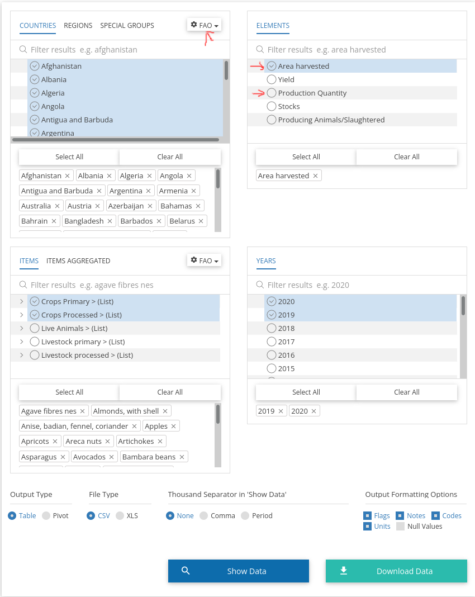

# Crops parser

This shell script parses data from the [Food and Agriculture Organization of the United Nations](https://www.fao.org/faostat/en/#data/QCL) about the cultivated/planted plants/fruits on the world into a YAML file, which groups them per country to see the top 15.

It has been created for the OpenStreetMap mapping app [StreetComplete](https://github.com/westnordost/StreetComplete), see [this issue](https://github.com/westnordost/StreetComplete/issues/368) for details.

## How to download data?

Go to the [FAQ website](https://www.fao.org/faostat/en/#data/QCL) and download the FAO data. Things to remember:
1. Select all countries and **switch to the ISO3** coding system.
2. Either select the area harvested (in ha) or the production quantity (in tonnes) to get useful results.
3. Select all crops in the items list. (The new FAO website merged crops [C] and livestock [L].)
4. Save the data.



## How to run it?

The script is mostly POSIX-compliant, so it should work on all systems, but a CLI tool called [csvtool](https://github.com/Chris00/ocaml-csv) has to be installed as it is used as a CSV parser.

If this is done, you can just execute it:
```shell
$ ./parseCrops.sh source/area_harvested_2019+2020.csv result/OsmOnly/mostAreaHarvest_2019+2020.yml
Prepare CSV…
Adjusting datasets…
Sum up duplicate elements…
Summed up 289 duplicates.
Calculate yearly average…
Sort data…
Evaluate data…
WARNING: No language code for North Macedonia could be found. Skip.
Finish processing…
```

## What does it?

This is an overview of what happens:
* `Prepare CSV…` – It strips the table header and extracts the columns of interest.
* `Adjusting datasets…` – Adjusts each dataset. E.g. it strips commas for easier processing, applies the blacklist and coverts the crop names to OSM keys (optional).
* `Sum up duplicate elements…` – Finds exact duplicates (considering the year too) and sums them up. Afterwards reports the sucess. (Usually items should only be summed up when converting OSM tags.)
* `Calculate yearly average…` – Calculates the average tonnes/area in production when multiple years are given.
* `Sort data…` – It sorts the whole data according to the tonnes of produced crops, independent of the country.
* `Evaluate data…` – It extracts all crops for each country and transforms the first fifteen crops listet into the YAML format. Additionally it replaces the country name with the 2-letter country code (ISO 3166).
* `Finish processing…` – It adds the header and default crops and sorts the YAML another time, so the countries are sorted.

## Result

The results can be seen in the directory [result](result). All legacy and more up-to-date data are included.

The script can handle multiple data from multiple years quite well. After summing up equal items per year (and country) it later calculates the average of the production numbers from both years.

## Extras

Additionally, there is a collection of square images of all "OSM fruits", which are included in the top-15. You can find it in the directory [`images`](images/).

## Legal stuff

The data is taken from the FAO and [licensed under the terms they describe]https://www.fao.org/contact-us/terms/db-terms-of-use/en/(), i.e. CC BY-NC-SA 3.0 IGO. This is described [in detail in this document](LICENSE-data.md).


Apart from that, all code part is licensed [under the MIT license](LICENSE.md).
